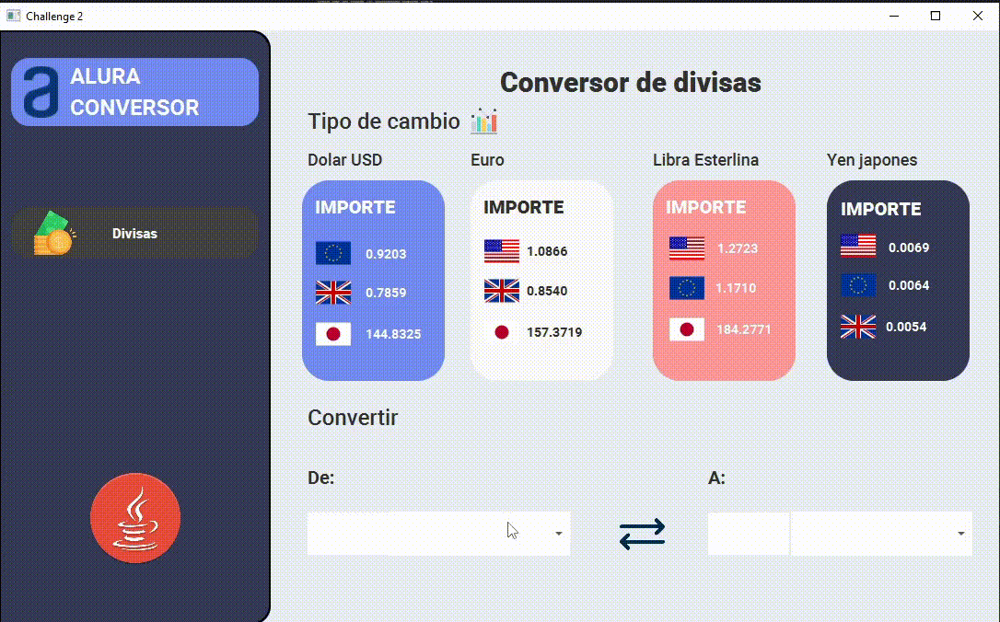

<h1 align="center">Alura Conversor Currencies</h1>

    
    

## Description
The Currency Converter is a JavaFX application designed to provide quick and easy currency conversion using the exchangeratesapi. This application allows users to convert between different currencies based on real-time exchange rates fetched from the exchangeratesapi. With an intuitive user interface and a seamless integration of API data, users can effortlessly perform accurate currency conversions for various monetary transactions.
## Instructions for use
To use this application and enable currency conversion functionality, follow these steps:
1. Create an Account on <a href="https://exchangeratesapi.io/">exchangeratesapi.io</a>
2. Upon signup, you'll receive an API key required to access real-time exchange rate data.
3. Locate the CallApi.java File from: `com/alurachallenge2conversor/util/CallAPI.java`
4. Open the CallApi.java file using a text editor or IDE. Look for the placeholder labeled as API_KEY and replace for your api key.
5. Save the File and run the Application.
## Usage Example
You can watch the matters for the most common currencies and convert different types of currencies.
1. Select the source and target currencies from the dropdown menus.
2. Enter the amount in the source currency.
3. The application convert the value in real-time.
4. You can swap the value of the combo box.

